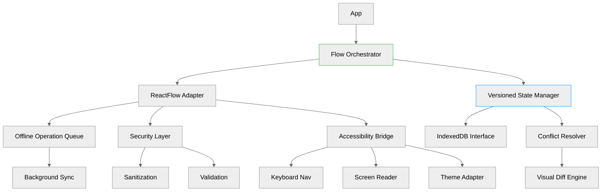

# React Flow Integration Architecture Plan

## Overview
Offline-first PWA implementation of react-flow diagramming with IndexedDB synchronization and conflict resolution. The system integrates with existing Material UI components and implements a robust offline-first architecture with version control and conflict resolution.

read for implementation: 
https://github.com/xyflow/xyflow

Always read the codebase first and change the md file if necessary. Use the bash for npm test to verify the implantation after every step.

Add or update the existing vitest and playwright (e2e) tests.

The implementation should prioritize user-friendliness, full responsiveness, robust error handling, security, optimal performance, accessibility, and adherence to best practices. Ensure that the solution is scalable, maintainable, and provides an intuitive user experience.

## Architecture Diagram


## Core Components

### Flow Orchestrator
```typescript
interface FlowState {
  nodes: VersionedNode[];
  edges: VersionedEdge[];
  viewport: Viewport;
  versionVector: Map<string, number>;
}

interface VersionedNode extends Node {
  version: number;
  lastModified: string;
  createdBy: string;
}
```

### Versioned State Manager
- Implements vector clocks for distributed version tracking
- Maintains node/edge version history
- Coordinates with IndexedDB for persistence
- Handles state rollback during conflicts

### Offline Queue
```typescript
enum OperationPriority {
  CRITICAL, // Node deletions
  HIGH,     // Edge changes
  NORMAL    // Position updates
}

interface QueuedOperation {
  id: string;
  type: OperationType;
  payload: any;
  priority: OperationPriority;
  timestamp: number;
  versionVector: Map<string, number>;
}
```

### Visual Diff Engine
- Reuses existing conflict resolution UI components
- Implements three-way merge for node content
- Provides visual diff interface for conflicting changes
- Supports manual conflict resolution

## Security Implementation

### Input Sanitization
```typescript
const sanitizeNode = (node: Node): Node => ({
  ...node,
  data: {
    ...node.data,
    content: DOMPurify.sanitize(node.data.content, {
      ALLOWED_TAGS: ['b', 'i', 'em', 'strong', 'br'],
      ALLOWED_ATTR: []
    })
  }
});
```

### Schema Validation
- Pre-storage validation of node/edge structure
- Type checking for all diagram elements
- Validation of node relationships and edge connections

### Data Protection
- Encryption of sensitive node content
- Secure storage in IndexedDB
- Access control integration with existing security layer

## Performance Optimization

### Virtualized Rendering
```typescript
interface VirtualizationConfig {
  viewportWidth: number;
  viewportHeight: number;
  nodeWidth: number;
  nodeHeight: number;
  overscanCount: number;
}

const VirtualizedFlow: React.FC<Props> = ({
  nodes,
  edges,
  config
}) => {
  const visibleNodes = useVirtualization(nodes, config);
  return <ReactFlow nodes={visibleNodes} edges={edges} />;
};
```

### Layout Worker
- Offloads layout calculations to Web Worker
- Implements incremental layout updates
- Handles large graph layouts without blocking UI

### State Updates
- Differential updates to React Flow state
- Batched node/edge modifications
- Optimistic UI updates with rollback capability

## Accessibility Features

### Keyboard Navigation
| Key Combination | Action |
|----------------|---------|
| Tab + Enter | Edit node |
| Shift + Arrows | Select multiple |
| Ctrl + Space | Toggle connection |
| Alt + Arrows | Pan viewport |

### Screen Reader Support
- ARIA labels for nodes and edges
- Live region announcements for state changes
- Role and state management for interactive elements

### Theme Integration
- High contrast mode support
- Dynamic color adaptation
- Reduced motion considerations

## Validation Checklist
- [ ] Security test suite passes (test:sanitization)
- [ ] Performance benchmark: 60fps with 50k+ elements
- [ ] RTL language support verification
- [ ] High contrast mode compliance (WCAG 2.2 AA)
- [ ] Offline functionality testing
- [ ] Conflict resolution testing
- [ ] Accessibility compliance testing

## Maintenance Strategy
1. Schema versioning
   - Semantic versioning for flow data schema
   - Migration utilities for schema updates
   - Backward compatibility layer

2. Dependency Management
   - Automated React Flow compatibility checks
   - Regular security audits of dependencies
   - Performance regression testing

3. Monitoring
   - Performance budget tracking
   - Error rate monitoring
   - User interaction analytics

## Implementation Timeline
1. Week 1: Core React Flow integration
2. Week 2: Offline capabilities and IndexedDB
3. Week 3: Conflict resolution and sync
4. Week 4: Performance optimization
5. Week 5: Accessibility and testing