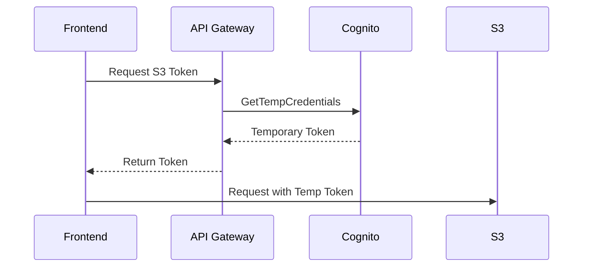

# S3 403 Resolution Plan

## Immediate Actions
1. **Verify AWS Credentials**
   - Check `.env` for valid AWS_ACCESS_KEY_ID/AWS_SECRET_ACCESS_KEY
   - Confirm IAM user has `s3:GetObject` permission

2. **Environment Configuration**
```env
# Required .env variables
S3_ENDPOINT=https://your-s3-endpoint.com
S3_BUCKET_NAME=your-bucket-name
AWS_ACCESS_KEY_ID=your_access_key
AWS_SECRET_ACCESS_KEY=your_secret_key
```

3. **S3 Service Configuration**
```ts
// mind-map-pwa/src/services/s3SyncService.ts
const s3 = new AWS.S3({
  endpoint: process.env.S3_ENDPOINT,
  signatureVersion: 'v4' // Required for presigned URLs
});
```

4. **Bucket Policy Check**
```json
{
  "Version": "2012-10-17",
  "Statement": [{
    "Effect": "Allow",
    "Principal": "*",
    "Action": "s3:GetObject",
    "Resource": "arn:aws:s3:::${S3_BUCKET_NAME}/*"
  }]
}
```

## Architectural Improvements
1. **Credential Security**


2. **Error Handling Pattern**
```ts
class S3Error extends Error {
  constructor(public code: string, message: string) {
    super(message);
  }
}

// Usage
try {
  await s3.getObject({
    Bucket: process.env.S3_BUCKET_NAME,
    Key: 'example.json'
  }).promise();
} catch (error) {
  throw new S3Error(error.code, `S3 operation failed: ${error.message}`);
}
```

## PWA Verification Steps
1. **Environment Check Function**:
```ts
function verifyS3Config() {
  const requiredVars = ['S3_ENDPOINT', 'S3_BUCKET_NAME', 'AWS_ACCESS_KEY_ID', 'AWS_SECRET_ACCESS_KEY'];
  const missing = requiredVars.filter(varName => !process.env[varName]);
  
  if (missing.length > 0) {
    throw new Error(`Missing required environment variables: ${missing.join(', ')}`);
  }

  return true;
}
```

2. **Connection Test Function**:
```ts
async function testS3Connection() {
  try {
    // List a single object to verify connectivity
    await s3.listObjectsV2({
      Bucket: process.env.S3_BUCKET_NAME,
      MaxKeys: 1
    }).promise();
    return { success: true, message: 'S3 connection successful' };
  } catch (error) {
    return { 
      success: false, 
      message: `S3 connection failed: ${error.message}`,
      code: error.code
    };
  }
}
```

3. **CORS Configuration**:
```xml
<!-- CORS configuration for offline PWA
     - Uses wildcard origin since PWA runs locally
     - Security maintained through presigned URLs
     - Access restricted by bucket policy and IAM roles -->
<CORSConfiguration>
  <CORSRule>
    <AllowedOrigin>*</AllowedOrigin>
    <AllowedMethod>GET</AllowedMethod>
    <AllowedHeader>*</AllowedHeader>
  </CORSRule>
</CORSConfiguration>